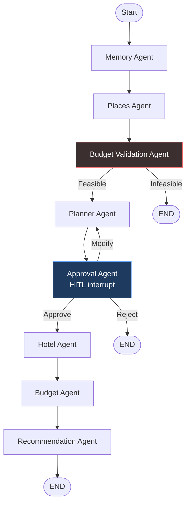

# DaybyDay — Agentic AI Travel Planning Assistant

> **Your itinerary, simplified.** A multi-agent travel planner for India — LangGraph orchestration, human-in-the-loop approval, MCP tools, and structured LLM outputs.


---

## Overview

**DaybyDay** helps groups plan India trips without a single overloaded prompt. A **LangGraph multi-agent pipeline** handles places discovery, budget checks, itinerary generation, human approval, stay selection, budget allocation, and personalized recommendations.

Users enter destination, days, group budget, travelers, and room count — review a proposed itinerary — then receive stays, a budget breakdown, local places, and ranked experiences. The system enforces **budget feasibility**, supports **approve / modify / reject** workflows via LangGraph interrupts, and persists session state per `thread_id`.

**Supported destinations:** Goa, Jaipur, Munnar, Varkala, Coorg, Shillong, Ooty, Manali

---

## Demo Screenshots

### Home / Trip Planning Form


*Trip input: destination, budget, days, travelers, rooms, and stay preference.*

### HITL Approval & Modification Flow


*Graph pauses for review — approve, request changes, or reject before stays are finalized.*

### Itinerary View


*Day-by-day plan with estimated costs, activities, and meals.*

### Stay Recommendations


*Recommended and alternative stays with pricing, budget fit, and post-plan switching.*

### Places Discovery


*Restaurants, attractions, and hidden gems grouped by category.*

### Budget Breakdown


*Stay cost, remaining budget, and food / transport / activities split.*

---

## Architecture



| Decision point | Route |
|----------------|-------|
| Budget validation | Feasible → Planner · Infeasible → END |
| HITL approval | Approve → Hotel · Modify → Planner · Reject → END |

Eight specialized agents run in sequence with conditional routing. Places are fetched **before** planning so itineraries reference real venues. Approval runs **before** stay and budget agents so users sign off on the trip shape first.

---

## Tech Stack

| Layer | Technology |
|-------|------------|
| Orchestration | LangGraph, MemorySaver checkpointing |
| LLM | Groq — Llama 3.3 70B |
| Structured outputs | Pydantic, `with_structured_output` |
| Tools | MCP servers (hotels, places) |
| Backend | FastAPI, Uvicorn |
| Frontend | Streamlit |
| Language | Python 3.11+ |

---

## Features

- Multi-agent orchestration with LangGraph
- Human-in-the-loop itinerary approval (approve · modify · reject)
- Structured multi-day itinerary generation
- Pre-planning and in-graph budget validation
- Stay recommendations with alternative options and **stay switching**
- Preference memory per session thread
- MCP integrations for hotels and places
- Pydantic-validated agent outputs
- Streamlit product UI with session sync and trip history
- RESTful FastAPI backend

---

## Project Structure

```
travel-assistant-ai/
├── agents/           # LangGraph nodes (memory, places, planner, approval, hotel, budget, …)
├── api/              # FastAPI routes and serializers
├── data/             # Destination, hotel, and places datasets
├── frontend/         # Streamlit app + assets
├── graph/            # Workflow definition and TravelState
├── mcp_server/       # Hotel and Places MCP servers
├── memory/           # Checkpointer and preference store
├── models/           # Pydantic schemas
├── services/         # Stay update logic
├── tools/            # MCP clients
├── utils/            # Coercion, display, stay math, state helpers
├── tests/            # Regression tests
└── scripts/          # Optional dev smoke scripts
```

---

## Installation

**Prerequisites:** Python 3.11+, [Groq API key](https://console.groq.com/)

```powershell
# 1. Clone
git clone https://github.com/<your-username>/travel-assistant-ai.git
cd travel-assistant-ai

# 2. Virtual environment
python -m venv venv
.\venv\Scripts\Activate.ps1

# 3. Dependencies
pip install fastapi uvicorn langgraph langchain-groq python-dotenv pydantic mcp
pip install -r frontend\requirements.txt

# 4. Environment (.env in project root — do not commit)
# GROQ_API_KEY=your_key
# TRAVEL_API_URL=http://127.0.0.1:8000

# 5. Backend
.\venv\Scripts\uvicorn.exe api.main:app --reload

# 6. Frontend (separate terminal)
.\venv\Scripts\streamlit.exe run frontend\streamlit_app.py
```

- API: `http://127.0.0.1:8000`
- UI: `http://localhost:8501`

---

## API Endpoints

| Method | Endpoint | Purpose |
|--------|----------|---------|
| `POST` | `/plan-trip` | Start planning — returns `awaiting_approval`, `budget_infeasible`, or `completed` |
| `POST` | `/plan-trip/resume` | Resume after HITL — `action`: `approve` · `reject` · `modify` (+ `feedback`) |
| `POST` | `/plan-trip/select-stay` | Switch stay after completion; recalculates budget and recommendations |
| `GET` | `/plan-trip/status/{thread_id}` | Sync client state after refresh |

All responses include a `status`, `thread_id`, and payload (`approval_payload`, `result`, or `budget_error`).

---

## Testing

```powershell
.\venv\Scripts\python.exe tests\test_hitl.py
.\venv\Scripts\python.exe tests\test_budget.py
.\venv\Scripts\python.exe tests\test_destinations.py
.\venv\Scripts\python.exe tests\test_schema_and_feasibility.py
```

Tests cover HITL interrupt/resume flows, budget and stay-switch logic, destination/MCP data, and schema coercion with feasibility validation.

---

## Design Decisions

- **Places before planner** — itineraries reference real venues, not hallucinated names
- **HITL before stays** — users approve the trip shape before final costs are committed
- **Budget-aware at every stage** — feasibility gates + stay-aware allocation (42/28/30 split of remainder)
- **Explicit rooms & group budget** — stay cost = nightly rate × rooms × nights; budget is for the full party

---

## Future Improvements

- [ ] Docker containerization
- [ ] AWS deployment
- [ ] Persistent checkpoint storage (PostgreSQL / Redis)
- [ ] Integration with real travel APIs
- [ ] Additional MCP tools (weather, flights, events)
- [ ] Fully automated travel planning workflow
- [ ] Expanded destination coverage

---

## Skills Demonstrated

- **LangGraph** · **Agentic AI** · **Human-in-the-Loop Systems**
- **MCP** · **FastAPI** · **Streamlit** · **Pydantic**
- **State Management** · **Prompt Engineering** · **Multi-Agent Systems** · **Python**

---

## License

Add your license here (e.g. MIT).

## Author

Add your name and contact links here.
