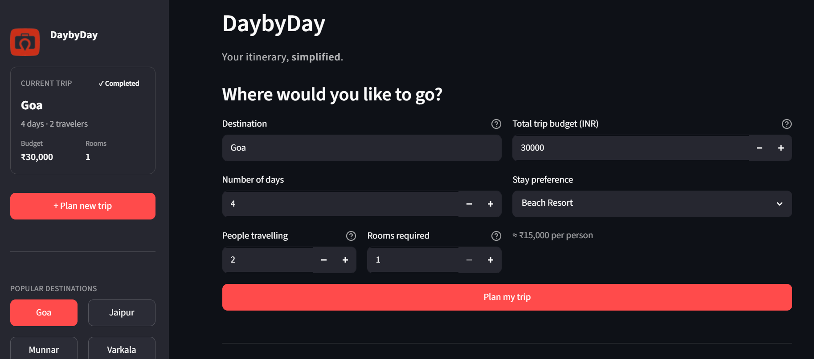
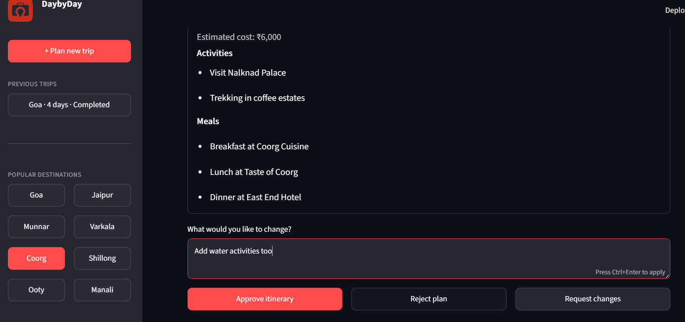
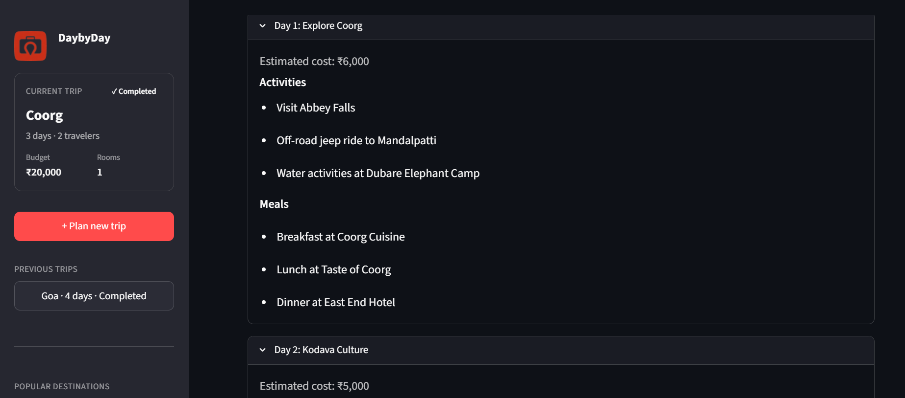
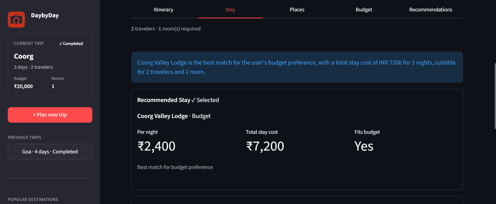
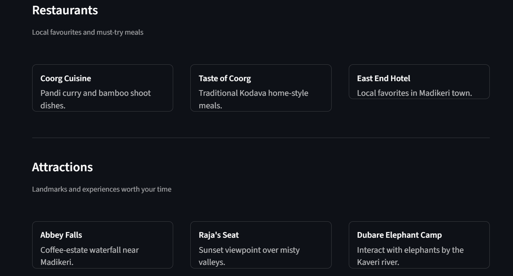
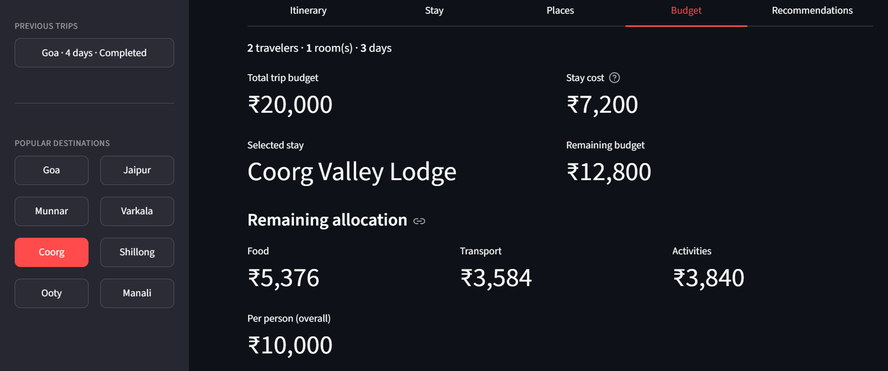

# DaybyDay — Agentic AI Travel Planning Assistant

> **Your itinerary, simplified.** A production-oriented multi-agent travel planner for India, built with LangGraph, human-in-the-loop approval, MCP tool integration, and structured LLM outputs.


---

## Overview

Planning a group trip involves trade-offs: budget limits, stay preferences, daily pacing, and whether an itinerary actually reflects a destination. **DaybyDay** automates that workflow using a **multi-agent LangGraph pipeline** instead of a single monolithic prompt.

The system:

- Orchestrates **specialized agents** (places discovery, planning, approval, stays, budget, recommendations)
- Pauses for **human-in-the-loop (HITL) approval** before committing to stays and final costs
- Targets **Indian destinations** with curated datasets and destination-aware tool servers
- Enforces **budget feasibility** before and during planning
- Persists **session state and preferences** per thread via LangGraph checkpointing
- Exposes a **FastAPI** backend and a **Streamlit** product UI

Users describe a trip (destination, days, group budget, travelers, rooms, stay preference), review a proposed itinerary, then receive stay options, a budget breakdown, local places, and personalized recommendations.

---

## Demo Screenshots

A walkthrough of the DaybyDay Streamlit experience — from trip input through human approval to the completed plan.

### Home / Trip Planning Form



*Users enter destination, group budget, trip length, travelers, rooms, and stay preference to start the agent workflow.*

### HITL Approval & Modification Flow



*The graph pauses for human review. Users can approve the itinerary, request changes with feedback, or reject the plan before stays are finalized.*

### Itinerary View



*Day-by-day plan with estimated costs, activities, and meals — generated by the Planner Agent using places context.*

### Stay Recommendations



*Three stay options with per-night pricing, total stay cost, budget fit, and the ability to switch alternatives after completion.*

### Places Discovery



*Curated local places grouped by category, discovered via the Places MCP pipeline before and after planning.*

### Budget Breakdown



*Total budget, selected stay cost, remaining balance, and food / transport / activities allocation for the traveling group.*

---

## Architecture

DaybyDay uses a **directed agent workflow** with conditional routing after budget validation and HITL approval.


**Routing summary**

| Decision point | Route |
|----------------|-------|
| Budget validation | Feasible → Planner · Infeasible → END |
| HITL approval | Approve → Hotel · Modify → Planner · Reject → END |

---

## Agent Breakdown

| Agent | Responsibility |
|-------|----------------|
| **Memory Agent** | Loads and persists user preferences per `thread_id`; normalizes trip defaults and clears stale state at graph entry |
| **Places Agent** | Fetches restaurants, attractions, and hidden gems via Places MCP; structures output as `PlaceRecommendations` |
| **Budget Validation Agent** | Computes minimum feasible budget (stay + food + transport); stops the graph early if the trip is underfunded |
| **Planner Agent** | Generates a structured multi-day itinerary using Groq LLM, destination highlights, and discovered places context |
| **Approval Agent** | Triggers LangGraph `interrupt()` for human review; handles approve, reject, and modify decisions via `Command(resume=...)` |
| **Hotel Agent** | Recommends three stays (1 primary + 2 alternatives) via Hotel MCP and structured LLM output |
| **Budget Agent** | Allocates remaining budget after selected stay cost (42% food, 28% transport, 30% activities) |
| **Recommendation Agent** | Produces four ranked top experiences with spend estimates and preference alignment |

---

## Human-in-the-Loop Workflow

After the planner generates an itinerary, the graph **pauses** at the approval node using LangGraph **`interrupt()`**. The API returns `status: awaiting_approval` with a payload containing the trip summary and proposed plan.

The client resumes execution with:

```python
Command(resume={"action": "approve", "feedback": ""})
# or: "reject" | "modify" (modify requires feedback)
```

| Action | Behavior |
|--------|----------|
| **Approve** | Continues to hotel search, budget allocation, and recommendations |
| **Modify** | Returns to the planner with user feedback; itinerary is regenerated |
| **Reject** | Ends the workflow with a rejected status |

**Why `interrupt()` instead of `input()`?**

- **Non-blocking**: The API server remains responsive; the UI can poll or resume asynchronously
- **Checkpoint-safe**: LangGraph persists graph state in `MemorySaver` keyed by `thread_id`
- **Production-compatible**: Works across HTTP, Streamlit, and future clients — not tied to a terminal session
- **Explicit contract**: Resume payloads are structured (`action`, `feedback`) rather than ad-hoc stdin parsing

---

## MCP Integration

Tool access is decoupled from agent logic through **Model Context Protocol (MCP)** servers. Agents call thin Python clients; MCP servers expose domain tools backed by curated datasets.

### Hotel MCP (`mcp_server/hotel_server.py`)

- Tool: `search_hotels(location)`
- Returns destination-specific stays (name, price, type)
- Used by the **Hotel Agent** after itinerary approval

### Places MCP (`mcp_server/places_server.py`)

- Returns structured local data:
  - **Restaurants**
  - **Attractions**
  - **Hidden gems**
- Used by the **Places Agent** before planning so the itinerary can reference real venue names

**Why MCP?**

- Separates **tool implementation** from **agent prompts**
- Enables independent testing and swapping of data sources (static datasets today, live APIs tomorrow)
- Keeps agents focused on reasoning while tools handle retrieval

---

## Structured Outputs

LLM responses are constrained with **Pydantic schemas** and LangChain **`with_structured_output`**, reducing free-text parsing failures.

| Mechanism | Purpose |
|-----------|---------|
| Pydantic models | Enforce types, required fields, and validators at the boundary |
| `with_structured_output` | Bind LLM output to schema (Planner, Hotel Agent) |
| `utils/coercion.py` | Coerce stringified numbers (`"₹1,200"`) to integers |
| `utils/structured_output.py` | Retry and normalize recommendation payloads |

**Key schemas** (`models/schemas.py`):

| Schema | Contents |
|--------|----------|
| `ItineraryPlan` | Multi-day plan with activities, meals, and per-day costs |
| `HotelRecommendation` | Three stay options with budget fit and total stay cost |
| `BudgetBreakdown` | Stay total, remaining budget, category splits, per-person estimate |
| `PlaceRecommendations` | Restaurants, attractions, hidden gems |
| `TripRecommendations` | Ranked top experiences with spend and preference match |

---

## Memory and State Management

| Concept | Implementation |
|---------|----------------|
| **Thread-based sessions** | Each trip uses a unique `thread_id` passed to LangGraph config |
| **Checkpointing** | `MemorySaver` stores graph state between invoke and resume |
| **Preference persistence** | In-process preference map keyed by `thread_id` (stay type, etc.) |
| **State shape** | `TravelState` TypedDict in `graph/state.py` |

**Current limitation:** `MemorySaver` is **in-memory**. Server restarts clear active sessions. The Streamlit UI detects stale checkpoints and prompts users to start a new trip. Production deployments should migrate to a **persistent checkpointer** (e.g. Postgres).

---

## Features

- Multi-agent orchestration with LangGraph
- Human-in-the-loop itinerary approval
- Dynamic, structured itinerary generation
- Pre-planning and in-graph budget validation
- Stay recommendations with alternative options
- Post-completion **stay switching** with budget and recommendation recalculation
- Preference memory across sessions (same thread)
- Multiple MCP integrations (hotels, places)
- Pydantic-validated structured outputs
- Streamlit product UI (**DaybyDay**)
- RESTful FastAPI backend with status sync and resume endpoints

**Supported destinations:** Goa, Jaipur, Munnar, Varkala, Coorg, Shillong, Ooty, Manali (with alias normalization and fallback datasets)

---

## Project Structure

```
travel-assistant-ai/
├── agents/                 # LangGraph node implementations
│   ├── memory.py
│   ├── places.py
│   ├── budget_validation.py
│   ├── planner.py
│   ├── approval.py
│   ├── hotel.py
│   ├── budget.py
│   └── recommendation.py
├── api/                    # FastAPI application
│   ├── main.py
│   └── serializers.py
├── data/                   # Destination, hotel, and places datasets
│   ├── destinations.py
│   └── places.py
├── frontend/               # Streamlit UI
│   ├── streamlit_app.py
│   ├── requirements.txt
│   └── assets/
├── graph/                  # LangGraph workflow definition
│   ├── travel_graph.py
│   └── state.py
├── mcp_server/             # MCP tool servers
│   ├── hotel_server.py
│   └── places_server.py
├── memory/                 # Checkpointer and preference store
│   ├── store.py
│   └── preferences.py
├── models/                 # Pydantic schemas
│   └── schemas.py
├── services/               # Application services (stay updates)
│   └── trip_update.py
├── tools/                  # MCP clients and config
│   ├── mcp_client.py
│   ├── mcp_config.py
│   ├── hotel_client.py
│   └── places_client.py
├── utils/                  # Coercion, display, stay math, state helpers
├── tests/                  # Regression and integration tests
├── scripts/                # Manual dev smoke scripts (optional)
├── Dockerfile
└── README.md
```

---

## Installation

### Prerequisites

- Python 3.11+
- [Groq API key](https://console.groq.com/) for LLM inference

### 1. Clone the repository

```powershell
git clone https://github.com/<your-username>/travel-assistant-ai.git
cd travel-assistant-ai
```

### 2. Create a virtual environment

```powershell
python -m venv venv
.\venv\Scripts\Activate.ps1
```

### 3. Install dependencies

Backend (core):

```powershell
pip install fastapi uvicorn langgraph langchain-groq python-dotenv pydantic mcp
```

Frontend:

```powershell
pip install -r frontend\requirements.txt
```

### 4. Configure environment variables

Create a `.env` file in the project root:

```env
GROQ_API_KEY=your_groq_api_key_here
TRAVEL_API_URL=http://127.0.0.1:8000
```

> **Never commit `.env` to version control.**

### 5. Run the backend

```powershell
.\venv\Scripts\uvicorn.exe api.main:app --reload
```

API available at `http://127.0.0.1:8000`

### 6. Run the frontend

In a second terminal:

```powershell
.\venv\Scripts\streamlit.exe run frontend\streamlit_app.py
```

UI available at `http://localhost:8501`

---

## API Endpoints

### `POST /plan-trip`

Start a new trip planning workflow.

**Request**

```json
{
  "destination": "Varkala",
  "days": 4,
  "budget": 30000,
  "travelers": 2,
  "rooms_required": 1,
  "thread_id": "user_session_001",
  "preferences": {
    "hotel_type": "Budget"
  }
}
```

**Responses**

Awaiting approval:

```json
{
  "status": "awaiting_approval",
  "thread_id": "user_session_001",
  "approval_payload": {
    "action_required": "itinerary_approval",
    "trip_summary": { "destination": "Varkala", "days": 4, "budget": 30000 },
    "itinerary_plan": { "days": [] }
  },
  "state": {}
}
```

Budget infeasible:

```json
{
  "status": "budget_infeasible",
  "thread_id": "user_session_001",
  "message": "Your budget is too low for this trip configuration.",
  "budget_error": {
    "user_budget": 5000,
    "minimum_feasible_budget": 12000,
    "budget_shortfall": 7000,
    "suggestions": ["Increase budget by at least ₹7,000"]
  }
}
```

---

### `POST /plan-trip/resume`

Resume a paused workflow after HITL approval.

**Request**

```json
{
  "thread_id": "user_session_001",
  "action": "approve",
  "feedback": ""
}
```

Modify example:

```json
{
  "thread_id": "user_session_001",
  "action": "modify",
  "feedback": "Add more beach time on Day 2 and reduce temple visits."
}
```

**Response (completed)**

```json
{
  "status": "completed",
  "thread_id": "user_session_001",
  "result": {
    "destination": "Varkala",
    "itinerary": {},
    "hotels": {},
    "budget_breakdown": {},
    "places": {},
    "recommendations": {}
  }
}
```

---

### `POST /plan-trip/select-stay`

Switch the selected stay after planning is complete; recalculates budget and recommendations.

**Request**

```json
{
  "thread_id": "user_session_001",
  "hotel_name": "Cliff View Resort"
}
```

**Response**

```json
{
  "status": "completed",
  "thread_id": "user_session_001",
  "result": {}
}
```

---

### `GET /plan-trip/status/{thread_id}`

Sync client state after page refresh or reconnect.

**Response**

Same shape as plan/resume endpoints: `awaiting_approval`, `completed`, `rejected`, or `budget_infeasible`.

---

## Testing

Run from the project root:

```powershell
.\venv\Scripts\python.exe tests\test_hitl.py
.\venv\Scripts\python.exe tests\test_budget.py
.\venv\Scripts\python.exe tests\test_destinations.py
.\venv\Scripts\python.exe tests\test_schema_and_feasibility.py
.\venv\Scripts\python.exe tests\test_budget_infeasible_then_valid.py
```

| Test file | What it validates |
|-----------|---------------------|
| `tests/test_hitl.py` | LangGraph `interrupt()` and `Command(resume=...)` for approve, modify, and reject paths |
| `tests/test_budget.py` | Budget agent uses actual stay cost; stay switching updates breakdown correctly |
| `tests/test_destinations.py` | Destination normalization, per-city hotel/places data, MCP client integration |
| `tests/test_schema_and_feasibility.py` | Pydantic coercion, recommendation normalization, minimum budget calculations |
| `tests/test_budget_infeasible_then_valid.py` | Infeasible trip does not corrupt checkpoint; valid resubmit reaches approval |

Manual smoke scripts live in `scripts/` (optional, not required for CI).

---

## Design Decisions

| Decision | Rationale |
|----------|-----------|
| **Places before planner** | Itinerary generation references real restaurants and attractions instead of hallucinated venue names |
| **HITL before stay recommendations** | Users approve the trip shape before the system commits to stays and final budget splits |
| **Budget-aware planning** | Feasibility checks run before and inside the graph; shortfall responses include actionable suggestions |
| **Explicit room selection** | `rooms_required` is user-specified; stay cost = nightly rate × rooms × nights |
| **Group budget handling** | Total budget is for the entire traveling party; per-person estimates are derived for display |

---

## Future Improvements

- [ ] Persistent checkpointer (PostgreSQL / Redis) for production session durability
- [ ] Integration with real travel APIs (hotels, flights, activities)
- [ ] Expanded destination coverage beyond current Indian city datasets
- [ ] Consolidated `requirements.txt` and hardened Docker deployment
- [ ] Cloud deployment (container orchestration, secrets management, observability)

---

## Skills Demonstrated

This project showcases hands-on experience with:

- **LangGraph** — multi-step agent workflows, conditional routing, checkpointing
- **Agentic AI** — specialized agents with clear responsibilities
- **Human-in-the-Loop Systems** — `interrupt()` / resume patterns for production UX
- **MCP** — decoupled tool servers for hotels and places
- **FastAPI** — REST API design for async agent orchestration
- **Streamlit** — interactive product UI with session sync
- **Pydantic** — schema-first structured LLM outputs
- **State Management** — thread-scoped preferences and graph checkpoints
- **Prompt Engineering** — context-rich prompts with places, budget, and feedback
- **Multi-Agent Systems** — orchestrated pipeline vs. single-shot generation
- **Python** — modular architecture, services layer, test coverage

---

## License

Add your license here (e.g. MIT).

## Author

Add your name and contact links here.
