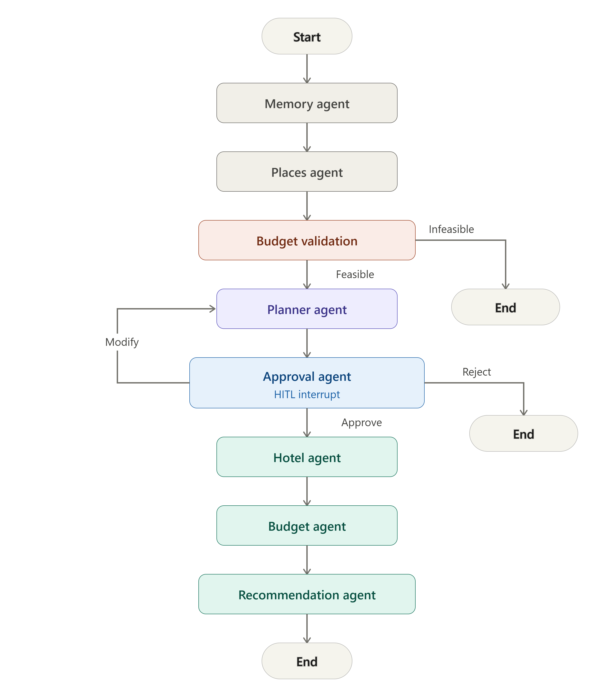

# DaybyDay — Agentic AI Travel Planning Assistant

> Your itinerary, simplified. A multi-agent travel planner for India, built with LangGraph, human-in-the-loop approval, and MCP tool integration.

---

## Overview

DaybyDay automates trip planning using a **multi-agent LangGraph pipeline** instead of a single monolithic prompt. The system orchestrates specialized agents for places discovery, planning, approval, stays, budget, and recommendations — pausing for human approval before committing to a plan.

Users describe a trip (destination, days, budget, travelers, stay preference), review a proposed itinerary, then receive stay options, a budget breakdown, local places, and personalized recommendations.

**Supported destinations:** Goa, Jaipur, Munnar, Varkala, Coorg, Shillong, Ooty, Manali

---

## Demo

| Trip planning form | HITL approval | Itinerary |
|---|---|---|
|  |  |  |

| Stay options | Places | Budget |
|---|---|---|
|  |  |  |

---

## Architecture

<p align="center">
  
</p>

| Agent | Responsibility |
|-------|----------------|
| Memory | Loads/persists user preferences per `thread_id` |
| Places | Fetches restaurants, attractions, hidden gems via Places MCP |
| Budget Validation | Stops the graph early if the trip is underfunded |
| Planner | Generates a structured multi-day itinerary (Groq LLM + places context) |
| Approval | Triggers LangGraph `interrupt()` for human review (approve / modify / reject) |
| Hotel | Recommends 3 stays (1 primary + 2 alternatives) via Hotel MCP |
| Budget | Allocates remaining budget (food / transport / activities) |
| Recommendation | Produces ranked top experiences with spend estimates |

---

## Why these design choices

- **Human-in-the-loop via `interrupt()`** — pauses the graph non-blockingly using LangGraph's checkpoint system instead of blocking on `input()`. Production-compatible across HTTP/UI clients, not tied to a terminal session.
- **MCP for tool access** — hotel and places lookups are separate MCP servers, not inline functions. This decouples tool implementation from agent prompts and lets data sources be swapped (static today, live APIs later) without touching agent logic.
- **Places before planning** — the itinerary references real restaurant/attraction names instead of hallucinated ones.
- **Structured outputs** — Pydantic schemas + `with_structured_output` constrain every LLM response, avoiding free-text parsing failures.

---

## Tech stack

`Python` `LangGraph` `LangChain` `Groq (Llama 3.3 70B)` `FastAPI` `MCP` `Pydantic` `Streamlit`

---

## Project structure

```
travel-assistant-ai/
├── agents/                          # LangGraph agent nodes
│   ├── memory.py                    # Load/persist user preferences per thread
│   ├── places.py                    # Fetch restaurants, attractions, hidden gems
│   ├── budget_validation.py         # Early budget feasibility gate
│   ├── planner.py                   # Multi-day itinerary generation (Groq LLM)
│   ├── approval.py                  # HITL interrupt — approve / modify / reject
│   ├── hotel.py                     # Stay recommendations via Hotel MCP
│   ├── budget.py                    # Post-stay budget allocation
│   └── recommendation.py            # Ranked experience suggestions
│
├── api/                             # FastAPI REST layer
│   ├── main.py                      # /plan-trip, /resume, /select-stay, /status
│   └── serializers.py               # Request and response models
│
├── data/                            # Static destination datasets
│   ├── destinations.py              # Supported cities and pricing metadata
│   ├── places.py                    # Restaurants, attractions, hidden gems
│   └── hotels.py                    # Stay listings by destination
│
├── docs/
│   └── screenshot_agentic/          # README demo screenshots and workflow diagram
│
├── frontend/                        # Streamlit UI
│   ├── streamlit_app.py             # Trip form, HITL flow, trip history, tabs
│   ├── assets/
│   │   └── daybyday_logo.png
│   └── requirements.txt
│
├── graph/                           # LangGraph workflow definition
│   ├── travel_graph.py              # Graph nodes, edges, and conditional routing
│   └── state.py                     # TravelState schema
│
├── mcp_server/                      # MCP tool servers
│   ├── hotel_server.py              # Stay search and pricing tools
│   └── places_server.py             # Places discovery tools
│
├── memory/                          # Session persistence
│   ├── store.py                     # MemorySaver checkpointer setup
│   └── preferences.py               # Per-thread user preference store
│
├── models/
│   └── schemas.py                   # Pydantic schemas for structured LLM outputs
│
├── services/
│   └── trip_update.py               # Stay switching and budget recalculation
│
├── tools/                           # MCP client integrations
│   ├── mcp_client.py                # Shared MCP client utilities
│   ├── hotel_client.py              # Hotel MCP client
│   ├── places_client.py             # Places MCP client
│   └── mcp_config.py                # MCP server configuration
│
├── utils/                           # Shared helpers
│   ├── coercion.py                  # Type coercion for agent outputs
│   ├── display.py                   # UI formatting helpers
│   ├── stay.py                      # Stay cost and selection logic
│   ├── state_helpers.py             # Graph state accessors
│   └── structured_output.py         # LLM structured output utilities
│
├── scripts/                         # Optional dev smoke scripts
│   ├── test.py
│   ├── test_groq.py
│   ├── test_mcp.py
│   └── test_memory.py
│
├── tests/                           # Regression tests
│   ├── test_hitl.py                 # HITL approve / modify / reject flows
│   ├── test_budget.py               # Budget allocation and stay switching
│   ├── test_budget_infeasible_then_valid.py
│   ├── test_destinations.py         # Destination and MCP data coverage
│   └── test_schema_and_feasibility.py
│
├── Dockerfile
├── .dockerignore
├── .gitignore
└── README.md
```

---

## Installation

```powershell
git clone https://github.com/Nailasalim/agentic-travel-assistant.git
cd agentic-travel-assistant
python -m venv venv
.\venv\Scripts\Activate.ps1

pip install fastapi uvicorn langgraph langchain-groq python-dotenv pydantic mcp
pip install -r frontend\requirements.txt
```

Create a `.env` file:

```env
GROQ_API_KEY=your_groq_api_key_here
TRAVEL_API_URL=http://127.0.0.1:8000
```

Run the backend:

```powershell
.\venv\Scripts\uvicorn.exe api.main:app --reload
```

Run the frontend (second terminal):

```powershell
.\venv\Scripts\streamlit.exe run frontend\streamlit_app.py
```

UI: `http://localhost:8501` · API: `http://127.0.0.1:8000`

---

## API endpoints

| Endpoint | Purpose |
|----------|---------|
| `POST /plan-trip` | Start a new trip planning workflow |
| `POST /plan-trip/resume` | Resume after HITL approval (`approve` / `modify` / `reject`) |
| `POST /plan-trip/select-stay` | Switch selected stay; recalculates budget |
| `GET /plan-trip/status/{thread_id}` | Sync client state after refresh/reconnect |

<details>
<summary>Example request/response</summary>

**POST /plan-trip**
```json
{
  "destination": "Varkala",
  "days": 4,
  "budget": 30000,
  "travelers": 2,
  "rooms_required": 1,
  "thread_id": "user_session_001",
  "preferences": { "hotel_type": "Budget" }
}
```

**Response (awaiting approval)**
```json
{
  "status": "awaiting_approval",
  "thread_id": "user_session_001",
  "approval_payload": {
    "action_required": "itinerary_approval",
    "trip_summary": { "destination": "Varkala", "days": 4, "budget": 30000 },
    "itinerary_plan": { "days": [] }
  }
}
```

</details>

---

## Testing

```powershell
.\venv\Scripts\python.exe tests\test_hitl.py
.\venv\Scripts\python.exe tests\test_budget.py
.\venv\Scripts\python.exe tests\test_destinations.py
```

Covers HITL approve/modify/reject paths, budget recalculation on stay switching, and destination/MCP data integration.

---

## What's next

- [ ] **Docker** — containerize the FastAPI backend + Streamlit frontend for one-command, deployment-ready execution
- [ ] **Real API integrations** — replace curated datasets with live hotel and places APIs
- [ ] **Weather MCP** — add a weather tool server so itineraries adapt to forecasted conditions
- [ ] **Full automation** — reduce manual HITL touchpoints for low-risk trip configurations, keeping approval only where budget or preference conflicts arise
- [ ] **Persistent checkpointer** (Postgres/Redis) — survive server restarts, currently in-memory only
- [ ] **Cloud deployment** — container orchestration, secrets management, observability

---

## Skills demonstrated

LangGraph (multi-agent orchestration, conditional routing, checkpointing) · Human-in-the-loop systems (`interrupt()` / resume) · MCP tool servers · FastAPI · Streamlit · Pydantic structured outputs · Prompt engineering · Python (modular architecture, test coverage)

---

## License

This project is licensed under the MIT License. See the LICENSE file for details.

## Author

**Naila Salim**

* GitHub: [Nailasalim](https://github.com/Nailasalim)
* LinkedIn: [nailansalim](https://www.linkedin.com/in/nailansalim/)

